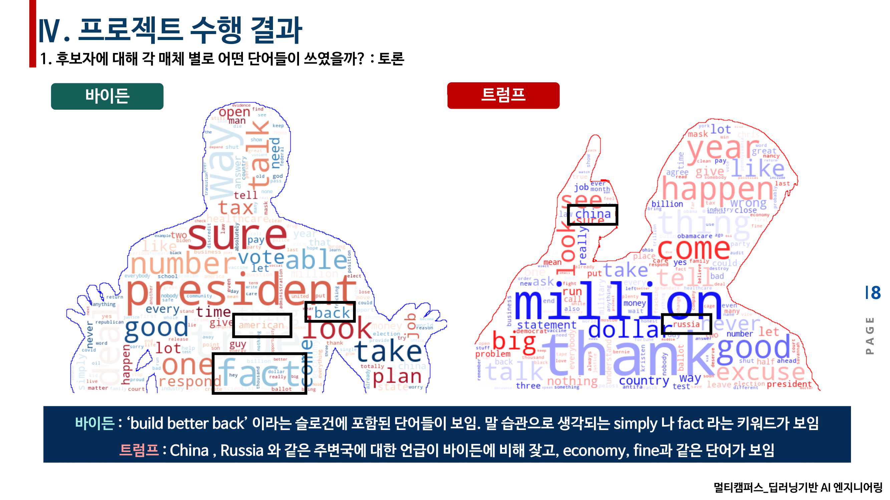

# 📰 미국 대선 관련 뉴스 기사 & 트위터 & 토론 텍스트 마이닝을 통한 감성 분석 및 예측 👍 👎   

\+ 멀티캠퍼스 딥러닝 기반 AI 엔지니어링 세미 1차 프로젝트 (NLP) (우수상 :star: ) 

​	

- __참여__ : [**jw0831**](https://github.com/jw0831) , [**Parkjiwonha**](https://github.com/Parkjiwonha) , [**ineed-coffee**](https://github.com/ineed-coffee) , [**jylee1215**](https://github.com/jylee1215) 
- __기간__ : 2020.10.29~2020.11.11
- __주제__ : 미국 대선 관련 뉴스 기사 & 트위터 & 토론 텍스트를 활용하여 기초적인 자연처 전처리 과정을 통해 감성 분석 및 대선 예측
- __결과보고서(전체 내용)__ :   [Here](https://drive.google.com/file/d/1ZaZFYiaszccdIro63gU2vP2HR_sLh6lT/view?usp=sharing)  

---
# 결과보고서 요약
 
 

***
# 분석 개요 및 목표

- 2016년 미국 대선에서 있었던 머신러닝 활용 선거 결과 예측을 시작으로 머신러닝/딥러닝 기술을 활용한 선거 예측이 많은 관심을 받게되었다.
- 이러한 흐름에 따라 2020 미국 대선의 결과를 `대선 토론` , `후보 관련 트위터` , `뉴스 기사` 등의 텍스트 데이터를 활용하여 __LSTM 기반 모델링__ 을 통해 선거 결과를 예측 해보고 각 데이터 성격에 따라 __word2vec 기반 연관단어 분석__ , __TF-IDF 기반 키워드 분석__ , __LDA 토픽 추출__ , __빈도수 기반 wordcloud__ , __sentiment analysis__ 등의 분석 진행을 목표로함
- 세부 분석 주제는 6가지로 구성

 
 
 

***
# 참여인원 역할

작성자(이동재) 주요 담당 부분

1. 데이터 수집 : 뉴스\([FOX](https://www.foxnews.com/)\) , 대선 토론\([Kaggle](https://www.kaggle.com/headsortails/us-election-2020-presidential-debates)\)
2. 데이터 전처리 소스코드 통합 및 버전 관리
3. 통합 데이터 기반 LDA 토픽 모델링 및 시각화
4. Tensorboard Embedding Projector 활용 트위터 데이터 word2vec 결과 3D 시각화

 

***
# 데이터 수집 결과 및 전처리 과정
 
 

***
# 세부주제 분석 내용 (일부)
### 1. 후보자에 대해 각 매체 별로 (토론/트위터/기사) 어떤 단어들이 쓰였을까?

### `대선 토론` 

 
### `트위터` 
 
__`바이든`__ 

>  today , together , build 
>
> 중립 적이거나 슬로건과 연관이 있는 키워드가 주요 키워드로 확인

__`트럼프`__ 

>  news, fake , great
>
> 거짓 뉴스에 대한 트윗 비중이 꽤 있으며, 바이든과 마찬가지로 슬로건 관련 키워드를 확인

---

### 2. 전체 매체 (토론/트위터/기사)에서 후보자들과 관련 있는 단어들은 무엇일까?
### `Word2Vec` 
 
__바이든__ 

>  트럼프,카말라와 같은 주변 인물 단어 확인
>
> sleepy , hide , son 같은 부정적인 단어 확인

 
__트럼프__ 

>  fallen , desperate , hysterical 같은 직접적인 부정 단어부터 weak , xenophobia 와 같은 간접적인 부정 단어들을 확인
>
> 주변 인물에 단어의 등장은 적은 대신 minesota 와 같은 경합 주에 대한 단어 비중이 높은 것을 확인

### `LDA` 
 
__대선 토론 데이터 활용 LDA 토픽 추출 : 후보별 4가지 토픽 선정__ 

> 두 후보 모두 선거 토픽에 관련된 단어는 공통적으로 등장 , 
>
> 트럼프의 경우 ‘American first’ 슬로건처럼 군사 토픽과 경제 토픽에 무게가 더 많이 실렸고 
>
> 바이든의 경우 ‘build better back’ 슬로건처럼 통합을 강조하는 복지 토픽과 이슈 토픽에 단어 빈도가 큰 것을 확인

***
### 3. 언론사의 편향과 선거는 어떤 관련이 있을까?
### `TF-IDF` 
 
 
__뉴스 데이터 활용 TF-IDF 키워드 분석__ 

> 해당 기간 동안에 바이든 평향 언론사 에서는 qanon, ufc 등 트럼프에 부정적인 단어들이 확인. 
>
> qanon은 미국의 극우세력을 대표하는 단어이며, ufc는 한 ufc선수가 자신이 qanon임을 밝힌 이슈와 관련되어 있음.
>
> 반면 트럼프 편향 언론사의 경우 penny, positive 등 트럼프 중 심의 긍정적인 단어들이 보였습니다.

***
### 5. 후보자들에 대한 감성은 어떻게 나타날까?
### `VADER sentiment analysis`
 
__SNS(twitter) 데이터를 활용한 두 후부에 대한 감성 분석__ 

> 소셜미디어 데이터의 감성분석이 용이한 [VADER](https://github.com/cjhutto/vaderSentiment) 감성사전 활용
>
> 문장 단위 스코어링을 통하여 최종 compound score 에 따른 __positive__ , __negative__ , __neutral__ 레이블링 후 일별 평균화 진행

 
__Peak point 조사 및 해석__ 

> 트럼프에 대한 감정은 긍정 및 부정의 변동이 심한 반면, 바이든은 대부분 긍정인 것으로 확인
>
> [트럼프]  10월 4일 : 트럼프 대통령이 코로나 확진 판정을 받은 이틀 후이며 가장 큰 긍정 점수를 확인할 수 있음
>
> [트럼프]  10월 20일 : 트럼프는 펜실베니아주 이리에서 선거 집회를 진행함
>
> [트럼프 , 바이든]  10월 29일 : 두 후보 모두 플로리다 주 탬파에서 집회를 진행하였으나, 트럼프는 이날 저녁 노스캐롤라이나주를 찾아 유세를 할 계획이었으나  `바람이 너무 많이 분다` 는 이유로 취소. 이로인한 부정 점수를 확인할 수 있음.

***
### 6. 후보자들에 대한 감성으로 선거 결과를 예측하면 어떻게 될까?
### `LSTM modeling`
 
__LSTM 기반 모델링을 통한 미래 감성지수 예측__ 

> 선거 당일의 각 후보에 대한 감성 지수를  예측하기 위해 각 후보의 일별 감성지수 데이터를 활용하여 각각 모델링을 진행
>
> I/O : Many-to-One
>
> Cell : 128
>
> Timestep : 7
>
> Input/output shape : (1,) , (1,)

 
__선거 당일 감성지수 예측결과 해석__ 

> 20.09.01~20.10.31 기간의 데이터로 학습 후 향후 5일에 대한 예측을 진행. (선거 당일 20.11.03 , 개표 20.11.05)
>
> [__트럼프__] : 이슈에 따라 감성 점수의 변화량이 큰 트럼프의 경우 11월에 접어들며 지속적인 하락세를 보일것으로 예측
>
> 투표 당일의 감성 점수 예측 = 0.02 (Strong Neutral) 
>
> [__바이든__] : 상승/하락의 폭이 비교적 좁은 바이든의 경우 선거 당일 소폭적인 상승세일 것으로 예측 
>
> 투표 당일의 감성 점수 예측 = 0.37 (Strong Positive)

***
# 분석 결과
 
 

***

